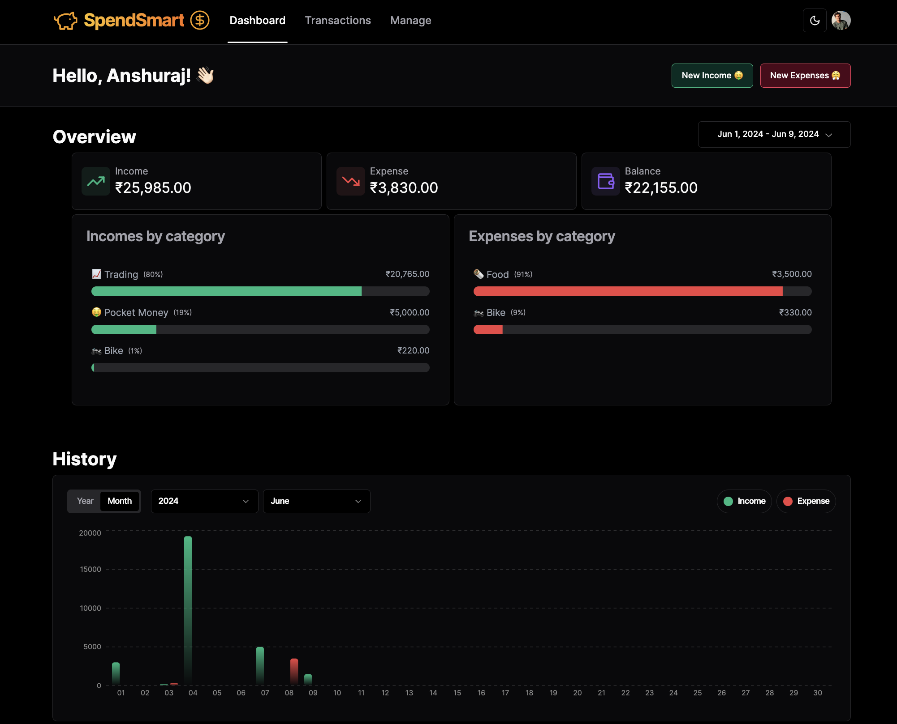
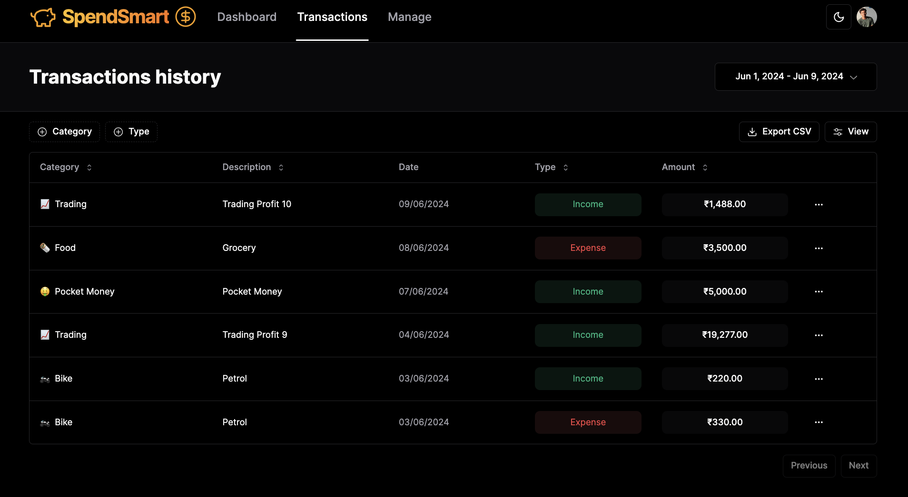
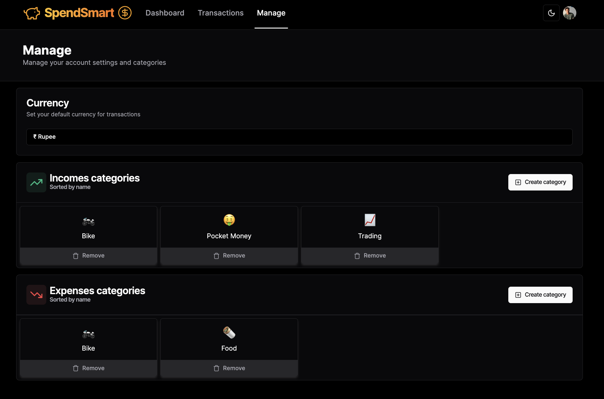

Sure! Below is a README file for your "Spend Smart" budget tracker project:

---





# Spend Smart 💰

Spend Smart is a full-stack budget tracker application designed to help users manage their finances efficiently. Built with modern web technologies, Spend Smart offers a seamless experience for tracking transactions, analyzing spending habits, and visualizing financial data.

## Features 🚀

- **Transaction Management**: Add, edit, and delete transactions with ease.
- **Category Statistics**: View aggregated data by category to understand spending patterns.
- **Historical Data Aggregates**: Analyze financial data over time for better insights.
- **Stunning Charts**: Visualize financial data using interactive charts.
- **Icon Selector for Categories**: Customize categories with unique icons for better organization.

## Technology Stack 👨🏻‍💻

### Frontend

- **Next.js 14**: Framework for server-rendered React applications.
- **TypeScript**: Adds type safety to JavaScript.
- **Tailwind CSS**: Utility-first CSS framework for rapid UI development.
- **Shadcn UI**: Component library for Next.js and Tailwind CSS.
- **Recharts**: Charting library for React.
- **React Query**: Data-fetching library to manage server state.

### Backend

- **Next.js 14 API Routes**: For building the API endpoints.
- **ServerActions**: For handling server-side logic.
- **SQLite / Vercel PostgreSQL**: Database for storing data.
- **Prisma**: ORM for database operations.
- **Clerk**: Authentication and user management.

## Getting Started

### Prerequisites

- Node.js (v14 or higher)
- npm or yarn

### Installation

1. Clone the repository:

   ```bash
   git clone https://github.com/goku-raj/spendSmart
   cd spend-smart
   ```

2. Install dependencies:

   ```bash
   npm install
   # or
   yarn install
   ```

3. Set up environment variables:
   Create a `.env` file in the root directory and add your Clerk API keys and database connection strings.

4. Set up the database:

   ```bash
   npx prisma migrate dev --name init
   ```

5. Run the development server:

   ```bash
   npm run dev
   # or
   yarn dev
   ```

6. Open [http://localhost:3000](http://localhost:3000) in your browser to see the app.

## Usage

### Transaction Management 🏦

- Navigate to the Transactions page to add, edit, or delete transactions.
- Use the form to input transaction details such as amount, category, and date.

### Category Statistics 📊

- View statistics aggregated by category to understand your spending patterns.
- Filter transactions by category to drill down into specific spending areas.

### Historical Data Aggregates 🧮

- Analyze your financial data over time.
- Use the charts to see trends and patterns in your spending habits.

### Stunning Charts 📈

- Navigate to the Charts page to visualize your financial data.
- Use different chart types to get a better understanding of your finances.

### Icon Selector for Categories 😁🚀

- Customize categories with unique icons.
- Choose from a library of icons to make your categories visually distinct.
